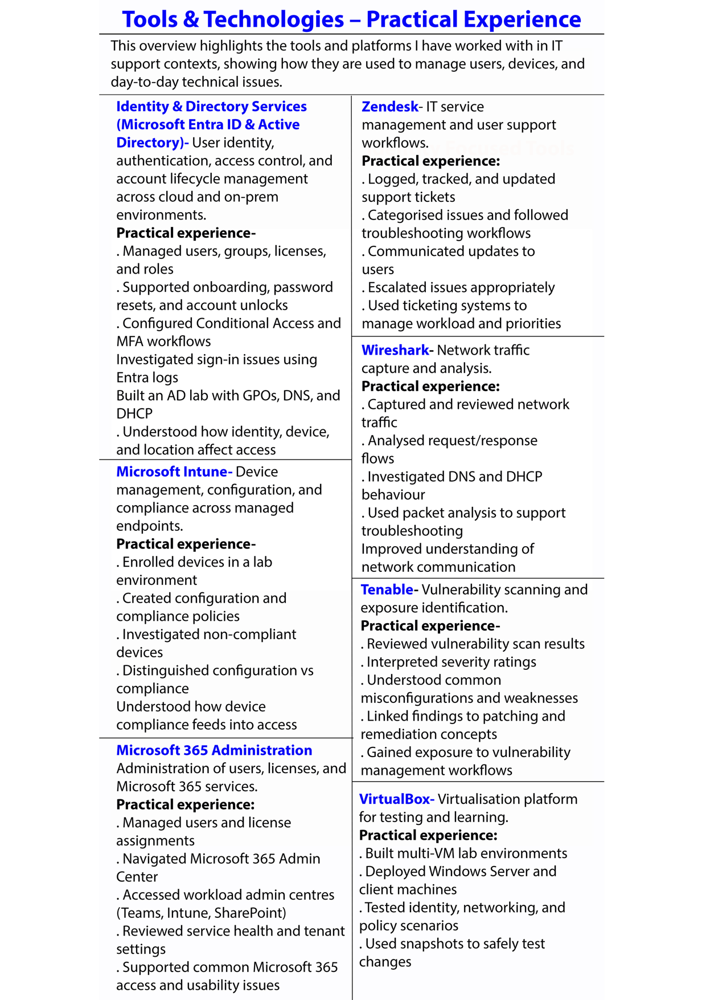
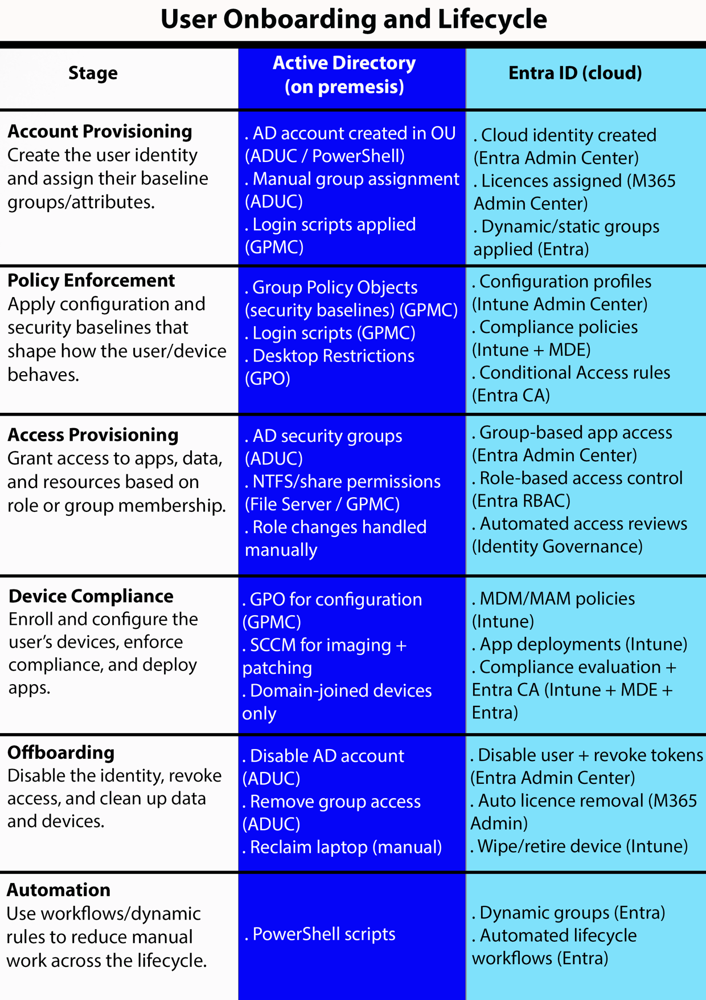
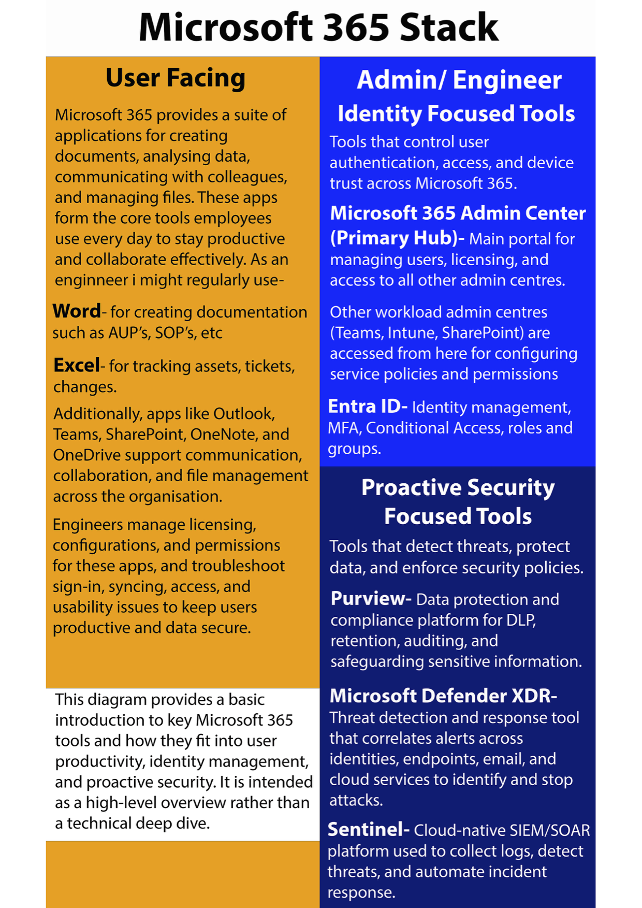

# Operating Systems – Configuration and Management

## Introduction

This repository provides an overview of operating system configuration, local diagnostics, user lifecycle management, and common administrative tooling used in modern IT environments.

## Local OS Diagnostics and Management Tools

This section focuses on **local Windows software and management tools** commonly used during the **information-gathering and initial diagnosis phase** of the troubleshooting process.

In an IT support or junior network role, these tools may be:
- Used directly by the engineer, or
- Used to guide an end user to provide system health information (CPU usage, errors, logs, services, etc.)

---

| Tool | Primary Use | When / Why It’s Used |
|----|----|----|
| **Task Manager** | Real-time system performance and process monitoring | First stop for identifying high CPU, memory, disk, or unresponsive applications. Useful for quick diagnostics. |
| **Task Manager – Processes** | View running apps and background processes | Identify resource-heavy processes, hung applications, or unusual activity. |
| **Task Manager – Performance** | Graphs of CPU, memory, disk, and network (last 60 seconds) | Useful for spotting spikes, bottlenecks, or resource exhaustion. |
| **Task Manager – Startup** | Manage apps that start at login | Used when slow boot times or unnecessary startup apps are suspected. |
| **Task Manager – Services** | Start, stop, or restart services | Helpful when a specific service (e.g. Print Spooler) is misbehaving. |
| **Task Manager – Users** | View logged-in users and their resource usage | Used on shared systems or RDP servers to identify active sessions. |
| **Resource Monitor** | Detailed view of CPU, memory, disk, and network usage | Provides deeper insight than Task Manager, especially for disk and network activity. |
| **System Configuration (msconfig)** | Control startup behaviour and boot options | Used for selective startup, troubleshooting boot issues, or safe boot scenarios. |
| **System Information (msinfo32)** | Detailed system overview | Used to capture hardware, components, and software environment details. |
| **System Information – Components** | Hardware information | Useful for identifying devices, drivers, and hardware configuration. |
| **System Information – Software Environment** | Drivers, services, environment variables | Helpful when diagnosing software conflicts or startup issues. |
| **Event Viewer** | Centralised OS logs | Used to investigate application crashes, system errors, security events, and warnings. |
| **Disk Management** | View and manage disks and partitions | Used for checking disk status, free space, partitions, and encryption. |
| **Disk Cleanup** | Remove temporary and unnecessary files | Used to recover disk space and improve system performance. |
| **Disk Defragmentation / Optimize Drives** | Optimize disk layout (HDD) | Used to improve performance on traditional hard drives. |
| **Device Manager** | View and manage hardware drivers | Used for driver updates, device errors, enabling/disabling hardware. |
| **Local Users and Groups** | Manage local accounts and permissions | Used for access issues, role separation, and local privilege management. |
| **Group Policy Editor (gpedit.msc)** | Configure local policies | Used to enforce security, system behaviour, and user restrictions. |
| **Certificate Manager** | View and manage certificates | Used when troubleshooting authentication, encryption, or application trust issues. |
| **Performance Monitor** | Long-term system performance tracking | Used to analyse trends, historical performance, and create alerts. |
| **Task Scheduler** | Run tasks on a schedule or trigger | Used for automation, maintenance tasks, and recurring scripts. |
| **Microsoft Management Console (MMC)** | Custom console for admin tools | Allows multiple snap-ins (Event Viewer, Disk Management, etc.) in one interface. |

These tools form the foundation of local troubleshooting and system management,
and are commonly used alongside higher-level configuration frameworks such as
Group Policy, identity management, and cloud-based administration.

---

They help answer questions such as:
- Is the system under resource pressure?
- Are required services running?
- Are there errors logged at the OS level?
- Has anything changed recently (drivers, startup apps, policies)?

---

## Notes for Real-World Use

- End users are often guided to **Task Manager, System Information, or Disk Cleanup** for basic diagnostics.
- Engineers rely more heavily on **Event Viewer, Device Manager, Performance Monitor, and Group Policy**.
- These tools are commonly used alongside **command-line utilities** and **remote management platforms** in enterprise environments.

# Administrative Platforms & System Management

This section focuses on **higher-level operating system administration,
identity management, and platform configuration**, rather than
individual device diagnostics.

These tools and diagrams represent how systems are:
- Configured and governed at scale
- Integrated with identity and access controls
- Managed across both on-prem and cloud environments

They are typically used by administrators and engineers to design,
maintain, and troubleshoot environments beyond a single endpoint,
supporting consistent configuration, security, and user lifecycle management.

## Tools and Technologies

## Operating System Troubleshooting & Key Settings

## Identity and User Lifecycle

## Microsoft 365 Overview

---

## Projects Showcasing These Skills

The following projects demonstrate practical use of the operating system
configuration, troubleshooting, and identity concepts covered on this page.

# Active Directory

## Entra ID

## [Identity driven access control](https)

## Windows

### [Group Policies](https://github.com/kierannutt123/Group-Policies/blob/main/Group%20Policies.md)

### [File Sharing and Permissions](https://github.com/kierannutt123/ActiveDirectoryFilePermissions/blob/main/Active%20Directory%20File%20Permissions.md)

